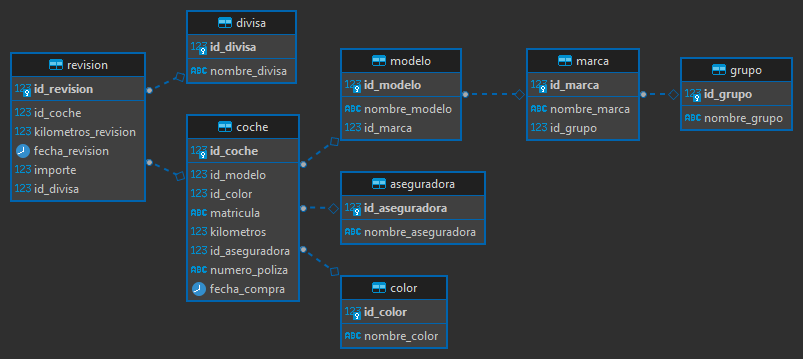
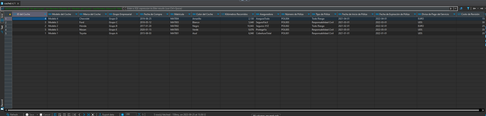

# Índice

1. [Resumen del Proyecto de Gestión de Flota de Vehículo](#resumen-del-proyecto-de-gestión-de-flota-de-vehículo)
   - [Componentes Clave](#componentes-clave)
2. [Gestión de Flota de Vehículos](#gestión-de-flota-de-vehículos)
   - [Modelo Entidad-Relación (ER)](#1-modelo-entidad-relación-er)
   - [Script SQL Autónomo](#2-script-sql-autónomo)
   - [Consulta SQL](#3-consulta-sql)
3. [Adaptación del Modelo Entidad-Relación y SQL](#adaptación-del-modelo-entidad-relación-y-sql)
   - [Entidades y Atributos](#entidades-y-atributos)
   - [Relaciones](#relaciones)
4. [Script SQL Adaptado](#script-sql-adaptado)
   - [Creación del Esquema](#creación-del-esquema)
   - [Creación de Tablas](#creación-de-tablas)
5. [Inserción de Datos de Muestra](#inserción-de-datos-de-muestra)
   - [Insertar Datos en la Tabla Grupo](#insertar-datos-en-la-tabla-grupo)
   - [Insertar Datos en la Tabla Marca](#insertar-datos-en-la-tabla-marca)
   - [Insertar Datos en la Tabla Modelo](#insertar-datos-en-la-tabla-modelo)
   - [Insertar Datos en la Tabla Aseguradora](#insertar-datos-en-la-tabla-aseguradora)
   - [Insertar Datos en la Tabla Divisa](#insertar-datos-en-la-tabla-divisa)
   - [Insertar Datos en la Tabla Color](#insertar-datos-en-la-tabla-color)
6. [Consulta SQL Profesional para Listar Coches Activos](#consulta-sql-profesional-para-listar-coches-activos)
   - [Detalles de la Consulta](#detalles-de-la-consulta)
   - [Código SQL](#código-sql)
7. [Pantalla Final](#pantalla-final)


# Resumen del Proyecto de Gestión de Flota de Vehículo.

Este proyecto se centra en la gestión eficiente de la flota de vehículos. Mediante la implementación de un sistema de base de datos en PostgreSQL, se busca tener un control completo sobre diversos aspectos de la flota, como modelos de vehículos, marcas, grupos empresariales y más. Además, se abarcan detalles como el color del coche, matrícula, kilómetros recorridos y datos de la aseguradora. Un aspecto clave es el seguimiento de las revisiones de cada vehículo, incluyendo la fecha, kilómetros al momento y costos. El proyecto incluye un script SQL autónomo para crear y poblar la base de datos, así como archivos CSV de ejemplo para pruebas.

## Componentes Clave

1. **Modelo Entidad-Relación (ER)**  
   Identificación de entidades, relaciones y atributos relevantes.

2. **Script SQL Autónomo**  
   Creación de esquemas, tablas y relaciones entre ellas.

3. **Consulta SQL**  
   Listado de coches activos con diversos detalles.

# Gestión de Flota de Vehículos.

La tarea tiene varios componentes clave que se deben abordar para una solución completa. Estos componentes son:

## 1. Modelo Entidad-Relación (ER)

El primer paso es crear un modelo Entidad-Relación (ER) normalizado. Este modelo servirá como la estructura subyacente para la base de datos. Se deben identificar las entidades relevantes, como `Coche`, `Marca`, `Grupo` y `Aseguradora`, así como sus relaciones y atributos.

## 2. Script SQL Autónomo

El segundo componente es un script SQL que es 100% autónomo. Esto significa que el script, cuando se ejecuta, debe:

- Crear todas las tablas necesarias según el modelo ER.
- Definir las claves primarias y claves foráneas para establecer las relaciones entre las tablas.
- Insertar algunos datos de muestra en las tablas.

Este script debe ser ejecutable en una base de datos PostgreSQL y debe crear un nuevo esquema (también conocido como espacio de trabajo) para alojar todas las tablas. No se debe utilizar el esquema `public` por defecto.

## 3. Consulta SQL

El tercer componente es una consulta SQL que pueda listar todos los coches activos en KeepCoding. Esta consulta debería ser capaz de mostrar:

- Modelo del coche
- Marca del coche
- Grupo al que pertenece la marca
- Fecha de compra del coche
- Matrícula del coche
- Color del coche
- Kilometraje total del coche
- Nombre de la empresa aseguradora
- Número de póliza de seguro

## Adaptación del Modelo Entidad-Relación y SQL.

Esta tarea implica la creación de un modelo Entidad-Relación (ER) y un script SQL que se ajusten a los requisitos específicos de la tarea. A continuación, se describen los componentes clave.

### Modelo Entidad-Relación Descriptivo para la Tarea

### Entidades y Atributos

#### 1. Grupo

- **ID_Grupo (PK)**
- Nombre_Grupo

#### 2. Marca
- **ID_Marca (PK)**
- Nombre_Marca
- ID_Grupo (FK)
  
#### 3. Modelo
- **ID_Modelo (PK)**
- Nombre_Modelo
- ID_Marca (FK)

#### 4. Aseguradora
- **ID_Aseguradora (PK)**
- Nombre_Aseguradora

#### 5. Divisa
- **ID_Divisa (PK)**
- Nombre_Divisa

#### 6. Color
- **ID_Color (PK)**
- Nombre_Color

#### 7. Coche
- **ID_Coche (PK)**
- ID_Modelo (FK)
- ID_Color (FK)
- Matricula
- Kilometros
- ID_Aseguradora (FK)
- Numero_Poliza
- Fecha_Compra

#### 8. Revision
- **ID_Revision (PK)**
- ID_Coche (FK)
- Kilometros_Revision
- Fecha_Revision
- Importe
- ID_Divisa (FK)

#### 9. Poliza

- **ID_Poliza (PK)**
- ID_Aseguradora (FK)
- Tipo_Poliza
- Fecha_Inicio
- Fecha_Expiracion
- Cobertura

### Relaciones

1. **Marca - Grupo**: Una Marca pertenece a un Grupo, y un Grupo puede tener múltiples Marcas. (1:N)
2. **Modelo - Marca**: Un Modelo pertenece a una Marca, y una Marca puede tener múltiples Modelos. (1:N)
3. **Coche - Modelo**: Un Coche tiene un Modelo, y un Modelo puede estar asociado con múltiples Coches. (1:N)
4. **Coche - Color**: Un Coche tiene un Color, y un Color puede estar asociado con múltiples Coches. (1:N)
5. **Coche - Aseguradora**: Un Coche está asegurado por una Aseguradora, y una Aseguradora puede asegurar múltiples Coches. (1:N)
6. **Revision - Coche**: Una Revisión se realiza en un Coche, y un Coche puede tener múltiples Revisiones. (1:N)
7. **Revision - Divisa**: Una Revisión está en una Divisa específica (EURO, DÓLAR, etc.). (1:1)
8. **Poliza - Aseguradora**: Una Póliza está asociada con una única Aseguradora, y una Aseguradora puede emitir múltiples Pólizas. (1:N)

## Modelo Entidad-Relación Descriptivo para la tabla Poliza

### Entidades y Atributos:

#### Poliza
- **ID_Poliza**: Identificador único para cada póliza de seguro. (Clave Primaria)
- **ID_Aseguradora**: Identificador de la aseguradora que emite la póliza. (Clave Externa)
- **Tipo_Poliza**: Tipo de la póliza de seguro, como "Responsabilidad Civil", "Todo Riesgo", etc.
- **Fecha_Inicio**: Fecha en la cual la póliza de seguro entra en vigencia.
- **Fecha_Expiracion**: Fecha en la cual la póliza de seguro expira.
- **Cobertura**: Texto que describe la cobertura ofrecida por la póliza, como daño a terceros, robo, etc.

### Relaciones:

#### Poliza - Aseguradora
- Una póliza está asociada con una única aseguradora.
- Una aseguradora puede emitir múltiples pólizas.
- **ID_Aseguradora** en la tabla `Poliza` es una clave externa que referencia **ID_Aseguradora** en la tabla `Aseguradora`.

### Restricciones:

- **ID_Poliza** es la clave primaria y debe ser única.
- **ID_Aseguradora** debe existir en la tabla `Aseguradora`.
- **Tipo_Poliza** no puede ser nulo.
- **Fecha_Inicio** y **Fecha_Expiracion** pueden ser opcionales dependiendo de la lógica del negocio.
- **Cobertura** es un campo de texto y puede contener información detallada sobre la cobertura de la póliza.




## Script SQL Adaptado

El segundo componente es un script SQL que es 100% autónomo. Este script debe:

- Crear todas las tablas necesarias según el modelo ER.
- Definir las claves primarias y claves foráneas para establecer las relaciones entre las tablas.
- [Aquí el enlace al script SQL](keepcoding_flota.sql)

# Consulta SQL para Obtener la Lista de Coches Activos

La consulta SQL al final del script tiene el propósito de obtener una lista de coches activos en KeepCoding, mostrando varios detalles de cada coche. A continuación, se explica cada parte de la consulta.

## Script SQL para la Gestión de la Flota de Coches

El siguiente script SQL crea un nuevo esquema y varias tablas en PostgreSQL para gestionar una flota de coches. Además, incluye una consulta para obtener una lista de coches activos. A continuación, se detalla cada sección del script.

## Creación del Esquema

```sql
-- Crear un nuevo esquema llamado KeepCoding
CREATE SCHEMA IF NOT EXISTS KeepCoding;

-- Cambiar al nuevo esquema
SET search_path TO KeepCoding;
```

Esta sección crea un nuevo esquema llamado `KeepCoding` y cambia el esquema de búsqueda al recién creado.

## Creación de Tablas

### Tabla Grupo

```sql
-- Crear la tabla Grupo
CREATE TABLE Grupo (
    ID_Grupo SERIAL PRIMARY KEY,
    Nombre_Grupo VARCHAR(50) NOT NULL
);
```
Esta tabla guarda la información sobre los diferentes grupos empresariales a los que pertenecen las marcas de coches.

### Tabla Marca

```sql
-- Crear la tabla Marca
CREATE TABLE Marca (
    ID_Marca SERIAL PRIMARY KEY,
    Nombre_Marca VARCHAR(50) NOT NULL,
    ID_Grupo INT REFERENCES Grupo(ID_Grupo)
);
```

### Tabla Modelo

```sql
-- Crear la tabla Modelo
CREATE TABLE Modelo (
    ID_Modelo SERIAL PRIMARY KEY,
    Nombre_Modelo VARCHAR(50) NOT NULL,
    ID_Marca INT REFERENCES Marca(ID_Marca)
);
```

### Tabla Aseguradora

```sql
-- Crear la tabla Aseguradora
CREATE TABLE Aseguradora (
    ID_Aseguradora SERIAL PRIMARY KEY,
    Nombre_Aseguradora VARCHAR(50) NOT NULL
);
```


```sql
-- Create Poliza table
CREATE TABLE IF NOT EXISTS Poliza (
    ID_Poliza SERIAL PRIMARY KEY,
    ID_Aseguradora INT REFERENCES Aseguradora(ID_Aseguradora),
    Tipo_Poliza VARCHAR(50) NOT NULL,
    Fecha_Inicio DATE,
    Fecha_Expiracion DATE,
    Cobertura TEXT
);
```

### Tabla Divisa

```sql
-- Crear la tabla Divisa
CREATE TABLE Divisa (
    ID_Divisa SERIAL PRIMARY KEY,
    Nombre_Divisa VARCHAR(10) NOT NULL
);
```

### Tabla Color

```sql
-- Crear la tabla Color
CREATE TABLE Color (
    ID_Color SERIAL PRIMARY KEY,
    Nombre_Color VARCHAR(20) NOT NULL
);
```

### Tabla Coche

```sql
-- Crear la tabla Coche
CREATE TABLE Coche (
    ID_Coche SERIAL PRIMARY KEY,
    ID_Modelo INT REFERENCES Modelo(ID_Modelo),
    ID_Color INT REFERENCES Color(ID_Color),
    Matricula VARCHAR(10) NOT NULL,
    Kilometros INT,
    ID_Aseguradora INT REFERENCES Aseguradora(ID_Aseguradora),
    Numero_Poliza VARCHAR(20),
    Fecha_Compra DATE
);
```

### Tabla Revision

```sql
-- Crear la tabla Revision
CREATE TABLE Revision (
    ID_Revision SERIAL PRIMARY KEY,
    ID_Coche INT REFERENCES Coche(ID_Coche),
    Kilometros_Revision INT,
    Fecha_Revision DATE,
    Importe FLOAT,
    ID_Divisa INT REFERENCES Divisa(ID_Divisa)
);
```

## Inserción de Datos de Muestra

Esta sección detalla cómo insertar datos de muestra en las tablas para facilitar las pruebas y la validación del modelo de base de datos.

Insertar Datos en la Tabla Grupo
Insertaremos 5 registros en la tabla Grupo. Cada grupo podría representar una corporación o conjunto de marcas de coches.

```sql
-- Insertar 5 registros en Grupo
INSERT INTO Grupo (Nombre_Grupo) VALUES
('Grupo A'),
('Grupo B'),
('Grupo C'),
('Grupo D'),
('Grupo E');
```

Insertar Datos en la Tabla Marca
Insertaremos 10 registros en la tabla Marca. Cada marca estará asociada con un grupo específico.

```sql
-- Insertar 10 registros en Marca
INSERT INTO Marca (Nombre_Marca, ID_Grupo) VALUES
('Toyota', 1),
('Honda', 2),
('Ford', 3),
('Chevrolet', 4),
('Nissan', 5),
('Volkswagen', 1),
('Hyundai', 2),
('Subaru', 3),
('Kia', 4),
('Jeep', 5);
```

Insertar Datos en la Tabla Modelo
Insertaremos 10 modelos de coches, cada uno asociado con una marca en específico.

```sql
-- Insertar 10 registros en Modelo
INSERT INTO Modelo (Nombre_Modelo, ID_Marca) VALUES
('Modelo 1', 1),
('Modelo 2', 2),
('Modelo 3', 3),
('Modelo 4', 4),
('Modelo 5', 5),
('Modelo 6', 6),
('Modelo 7', 7),
('Modelo 8', 8),
('Modelo 9', 9),
('Modelo 10', 10);
```

Insertar Datos en la Tabla Aseguradora
Insertaremos 10 registros en la tabla Aseguradora, representando diferentes compañías de seguros.

```sql
-- Insertar 10 registros en Aseguradora
INSERT INTO Aseguradora (Nombre_Aseguradora) VALUES
('CoberturaTotal'),
('Seguros XYZ'),
('SeguroFácil'),
('AseguraTodo'),
('ProtegeYa'),
('SeguroMax'),
('Confiaseguro'),
('SeguroClaro'),
('AseguraYA'),
('SeguroTOP');
```

Insertar Datos en la Tabla Divisa
Insertaremos 7 registros de diferentes divisas.

```sql
-- Insertar 7 registros en Divisa
INSERT INTO Divisa (Nombre_Divisa) VALUES
('EURO'),
('DOLLAR'),
('YEN'),
('POUND'),
('RUPEE'),
('YUAN'),
('PESO');
```

Insertar registros en la tabla Revision para simular pagos de servicios en diferentes divisas
```sql
INSERT INTO Revision (ID_Coche, Kilometros_Revision, Fecha_Revision, Importe, ID_Divisa) VALUES  
    (1, 7000, '2016-09-15', 200, 1), 
    (2, 11000, '2018-02-20', 250, 2), 
    (3, 6000, '2019-06-10', 300, 3), 
    (4, 2200, '2020-07-25', 150, 4),
    (5, 10000, '2021-01-30', 350, 5),
    (6, 7000, '2021-09-23', 200, 6),
    (7, 4200, '2022-05-05', 180, 7),
    (8, 2600, '2022-10-11', 160, 1),
    (9, 10200, '2023-04-21', 400, 2),
    (10, 5100, '2023-08-07', 300, 3);
```

Insertar Datos en la Tabla Color
Insertaremos 10 registros de diferentes colores que pueden tener los coches.

```sql
-- Insertar 10 registros en Color
INSERT INTO Color (Nombre_Color) VALUES
('Blanco'),
('Verde'),
('Azul'),
('Rojo'),
('Negro'),
('Gris'),
('Marrón'),
('Amarillo'),
('Plateado'),
('Violeta');
```

# Consulta SQL Profesional para Listar Coches Activos

Esta consulta SQL tiene como objetivo obtener una lista completa de coches activos en la base de datos, incluyendo varios detalles. Se recomienda ejecutar esta consulta después de haber insertado datos en las tablas relevantes.

## Detalles de la Consulta

1. **Establecer Formato de Fecha**: Se establece el formato de la fecha a 'YYYY-MM-DD'.
2. **Selección de Campos**: Seleccionamos campos específicos de diferentes tablas.
3. **Joins**: Utilizamos JOINs para relacionar diferentes tablas.
4. **Ordenación**: Los resultados se ordenan por Marca, Modelo, Divisa y Fecha de Compra.

## Código SQL

```sql
-- Establecer el formato para la Fecha_Compra a 'YYYY-MM-DD'
SET DATESTYLE TO ISO, MDY;

-- Iniciar la consulta
SELECT 
    co.ID_Coche AS "ID del Coche", 
    mo.Nombre_Modelo AS "Modelo del Coche", 
    ma.Nombre_Marca AS "Marca del Coche", 
    g.Nombre_Grupo AS "Grupo Empresarial",
    TO_CHAR(co.Fecha_Compra, 'YYYY-MM-DD') AS "Fecha de Compra",
    co.Matricula AS "Matrícula",
    col.Nombre_Color AS "Color del Coche",
    co.Kilometros AS "Kilómetros Recorridos",
    a.Nombre_Aseguradora AS "Aseguradora",
    co.Numero_Poliza AS "Número de Póliza",
    COALESCE(d.Nombre_Divisa, 'Sin Información') AS "Divisa de Pago del Servicio",
    COALESCE(r.Importe, 0) AS "Costo de Revisión"
FROM 
    Coche AS co
JOIN 
    Modelo AS mo ON co.ID_Modelo = mo.ID_Modelo
JOIN 
    Marca AS ma ON mo.ID_Marca = ma.ID_Marca
JOIN 
    Grupo AS g ON ma.ID_Grupo = g.ID_Grupo
JOIN 
    Color AS col ON co.ID_Color = col.ID_Color
JOIN 
    Aseguradora AS a ON co.ID_Aseguradora = a.ID_Aseguradora
LEFT JOIN 
    Revision AS r ON co.ID_Coche = r.ID_Coche
LEFT JOIN 
    Divisa AS d ON r.ID_Divisa = d.ID_Divisa
-- Ordenar los resultados por Marca, Modelo, Divisa y finalmente por Fecha de Compra
ORDER BY 
    "Marca del Coche", 
    "Modelo del Coche", 
    "Divisa de Pago del Servicio",
    "Fecha de Compra" ASC;
```

## Pantalla Final


