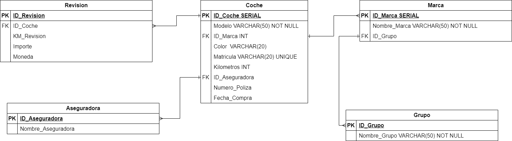

# Tarea de Gestión de Flota de Vehículos en KeepCoding

La tarea tiene varios componentes clave que se deben abordar para una solución completa. Estos componentes son:

## 1. Modelo Entidad-Relación (ER)

El primer paso es crear un modelo Entidad-Relación (ER) normalizado. Este modelo servirá como la estructura subyacente para la base de datos. Se deben identificar las entidades relevantes, como `Coche`, `Marca`, `Grupo` y `Aseguradora`, así como sus relaciones y atributos.

## 2. Script SQL Autónomo

El segundo componente es un script SQL que es 100% autónomo. Esto significa que el script, cuando se ejecuta, debe:

- Crear todas las tablas necesarias según el modelo ER.
- Definir las claves primarias y claves foráneas para establecer las relaciones entre las tablas.
- Insertar algunos datos de muestra en las tablas.

Este script debe ser ejecutable en una base de datos PostgreSQL y debe crear un nuevo esquema (también conocido como espacio de trabajo) para alojar todas las tablas. No se debe utilizar el esquema `public` por defecto.

## 3. Consulta SQL

El tercer componente es una consulta SQL que pueda listar todos los coches activos en KeepCoding. Esta consulta debería ser capaz de mostrar:

- Modelo del coche
- Marca del coche
- Grupo al que pertenece la marca
- Fecha de compra del coche
- Matrícula del coche
- Color del coche
- Kilometraje total del coche
- Nombre de la empresa aseguradora
- Número de póliza de seguro
# Adaptación del Modelo Entidad-Relación y SQL para la Tarea en KeepCoding

Esta tarea implica la creación de un modelo Entidad-Relación (ER) y un script SQL que se ajusten a los requisitos específicos de la tarea. A continuación, se describen los componentes clave.

---

## Modelo Entidad-Relación Descriptivo para la Tarea

### Entidades y Atributos

#### 1. Coche
- **ID_Coche (PK)**
- Modelo
- ID_Marca (FK)
- Color
- Matricula
- Kilometros
- ID_Aseguradora (FK)
- Numero_Poliza
- Fecha_Compra

#### 2. Marca
- **ID_Marca (PK)**
- Nombre_Marca
- ID_Grupo (FK)

#### 3. Grupo
- **ID_Grupo (PK)**
- Nombre_Grupo

#### 4. Aseguradora
- **ID_Aseguradora (PK)**
- Nombre_Aseguradora

#### 5. Revision
- **ID_Revision (PK)**
- ID_Coche (FK)
- Kilometros_Revision
- Fecha_Revision
- Importe
- Moneda

### Relaciones

1. **Coche - Marca**: Un coche pertenece a una Marca, y una Marca puede tener múltiples coches. (1:N)
2. **Marca - Grupo**: Una Marca pertenece a un Grupo, y un Grupo puede tener múltiples marcas. (1:N)
3. **Coche - Aseguradora**: Un coche está asegurado por una Aseguradora, y una Aseguradora puede asegurar múltiples coches. (1:N)
4. **Coche - Revision**: Un coche puede tener múltiples Revisiones, y una Revision pertenece a un Coche. (1:N)

---

## Script SQL Adaptado

El segundo componente es un script SQL que es 100% autónomo. Este script debe:

- Crear todas las tablas necesarias según el modelo ER.
- Definir las claves primarias y claves foráneas para establecer las relaciones entre las tablas.
- [Aquí el enlace al script SQL](script-sql-url)

