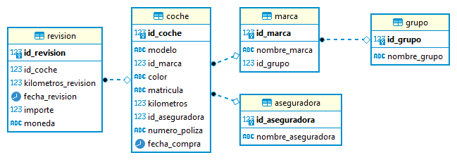

## Resumen del Proyecto de Gestión de Flota de Vehículos

Este proyecto se centra en la gestión eficiente de la flota de vehículos de una empresa. Mediante la implementación de un sistema de base de datos en PostgreSQL, se busca tener un control completo sobre diversos aspectos de la flota, como modelos de vehículos, marcas, grupos empresariales y más. Además, se abarcan detalles como el color del coche, matrícula, kilómetros recorridos y datos de la aseguradora. Un aspecto clave es el seguimiento de las revisiones de cada vehículo, incluyendo la fecha, kilómetros al momento y costos. El proyecto incluye un script SQL autónomo para crear y poblar la base de datos, así como archivos CSV de ejemplo para pruebas.

# Gestión de Flota de Vehículos en KeepCoding

La tarea tiene varios componentes clave que se deben abordar para una solución completa. Estos componentes son:

## 1. Modelo Entidad-Relación (ER)

El primer paso es crear un modelo Entidad-Relación (ER) normalizado. Este modelo servirá como la estructura subyacente para la base de datos. Se deben identificar las entidades relevantes, como `Coche`, `Marca`, `Grupo` y `Aseguradora`, así como sus relaciones y atributos.

## 2. Script SQL Autónomo

El segundo componente es un script SQL que es 100% autónomo. Esto significa que el script, cuando se ejecuta, debe:

- Crear todas las tablas necesarias según el modelo ER.
- Definir las claves primarias y claves foráneas para establecer las relaciones entre las tablas.
- Insertar algunos datos de muestra en las tablas.

Este script debe ser ejecutable en una base de datos PostgreSQL y debe crear un nuevo esquema (también conocido como espacio de trabajo) para alojar todas las tablas. No se debe utilizar el esquema `public` por defecto.

## 3. Consulta SQL

El tercer componente es una consulta SQL que pueda listar todos los coches activos en KeepCoding. Esta consulta debería ser capaz de mostrar:

- Modelo del coche
- Marca del coche
- Grupo al que pertenece la marca
- Fecha de compra del coche
- Matrícula del coche
- Color del coche
- Kilometraje total del coche
- Nombre de la empresa aseguradora
- Número de póliza de seguro

# Adaptación del Modelo Entidad-Relación y SQL para la Tarea en KeepCoding

Esta tarea implica la creación de un modelo Entidad-Relación (ER) y un script SQL que se ajusten a los requisitos específicos de la tarea. A continuación, se describen los componentes clave.

## Modelo Entidad-Relación Descriptivo para la Tarea

### Entidades y Atributos

#### 1. Coche
- **ID_Coche (PK)**
- Modelo
- ID_Marca (FK)
- Color
- Matricula
- Kilometros
- ID_Aseguradora (FK)
- Numero_Poliza
- Fecha_Compra

#### 2. Marca
- **ID_Marca (PK)**
- Nombre_Marca
- ID_Grupo (FK)

#### 3. Grupo
- **ID_Grupo (PK)**
- Nombre_Grupo

#### 4. Aseguradora
- **ID_Aseguradora (PK)**
- Nombre_Aseguradora

#### 5. Revision
- **ID_Revision (PK)**
- ID_Coche (FK)
- Kilometros_Revision
- Fecha_Revision
- Importe
- Moneda

### Relaciones

1. **Coche - Marca**: Un coche pertenece a una Marca, y una Marca puede tener múltiples coches. (1:N)
2. **Marca - Grupo**: Una Marca pertenece a un Grupo, y un Grupo puede tener múltiples marcas. (1:N)
3. **Coche - Aseguradora**: Un coche está asegurado por una Aseguradora, y una Aseguradora puede asegurar múltiples coches. (1:N)
4. **Coche - Revision**: Un coche puede tener múltiples Revisiones, y una Revision pertenece a un Coche. (1:N)




## Script SQL Adaptado

El segundo componente es un script SQL que es 100% autónomo. Este script debe:

- Crear todas las tablas necesarias según el modelo ER.
- Definir las claves primarias y claves foráneas para establecer las relaciones entre las tablas.
- [Aquí el enlace al script SQL](keepcoding_flota.sql)

# Consulta SQL para Obtener la Lista de Coches Activos en KeepCoding

La consulta SQL al final del script tiene el propósito de obtener una lista de coches activos en KeepCoding, mostrando varios detalles de cada coche. A continuación, se explica cada parte de la consulta.

## Código SQL

# Script SQL para la Gestión de la Flota de Coches en KeepCoding

El siguiente script SQL crea un nuevo esquema y varias tablas en PostgreSQL para gestionar una flota de coches. Además, incluye una consulta para obtener una lista de coches activos. A continuación, se detalla cada sección del script.

## Archivos CSV de Ejemplo para Pruebas de Script SQL

Los siguientes archivos CSV han sido generados para facilitar la prueba del script SQL. Cada archivo corresponde a una tabla en la base de datos y contiene datos de muestra que puedes importar.

### Tablas y Archivos Correspondientes

1. **Tabla Coche**: Contiene información sobre los vehículos, como el modelo, matrícula, kilómetros, etc.  
   - [Descargar archivo CSV para la tabla Coche](Coche_Example.csv)

2. **Tabla Marca**: Contiene información sobre las marcas de los vehículos y a qué grupo pertenecen.  
   - [Descargar archivo CSV para la tabla Marca](Marca_Example.csv)

3. **Tabla Grupo**: Contiene información sobre los grupos empresariales a los que pertenecen las marcas.  
   - [Descargar archivo CSV para la tabla Grupo](Grupo_Example.csv)

4. **Tabla Aseguradora**: Contiene información sobre las compañías aseguradoras.  
   - [Descargar archivo CSV para la tabla Aseguradora](Aseguradora_Example.csv)

5. **Tabla Revisión**: Contiene información sobre las revisiones realizadas a los vehículos.  
   - [Descargar archivo CSV para la tabla Revisión](Revision_Example.csv)

Estos archivos te servirán como datos de muestra para probar tu script SQL.

## Creación del Esquema

```sql
-- Crear un nuevo esquema llamado KeepCoding_Flota
CREATE SCHEMA IF NOT EXISTS KeepCoding_Flota;

-- Cambiar al nuevo esquema
SET search_path TO KeepCoding_Flota;
```

Esta sección crea un nuevo esquema llamado `KeepCoding_Flota` y cambia el esquema de búsqueda al recién creado.

## Creación de Tablas

### Tabla Grupo

```sql
-- Crear la tabla Grupo
CREATE TABLE Grupo (
    ID_Grupo SERIAL PRIMARY KEY,
    Nombre_Grupo VARCHAR(50) NOT NULL
);
```
Esta tabla guarda la información sobre los diferentes grupos empresariales a los que pertenecen las marcas de coches.

### Tabla Marca

```sql
-- Crear la tabla Marca
CREATE TABLE Marca (
    ID_Marca SERIAL PRIMARY KEY,
    Nombre_Marca VARCHAR(50) NOT NULL,
    ID_Grupo INT REFERENCES Grupo(ID_Grupo)
);
```

Esta tabla guarda la información sobre las diferentes marcas de coches y se relaciona con la tabla Grupo.

### Tabla Aseguradora

```sql
-- Crear la tabla Aseguradora
CREATE TABLE Aseguradora (
    ID_Aseguradora SERIAL PRIMARY KEY,
    Nombre_Aseguradora VARCHAR(50) NOT NULL
);
```

Esta tabla guarda la información sobre las diferentes compañías de seguros.

### Tabla Coche

```sql
-- Crear la tabla Coche
CREATE TABLE Coche (
    ID_Coche SERIAL PRIMARY KEY,
    Modelo VARCHAR(50) NOT NULL,
    ID_Marca INT REFERENCES Marca(ID_Marca),
    Color VARCHAR(20),
    Matricula VARCHAR(20),
    Kilometros INT,
    ID_Aseguradora INT REFERENCES Aseguradora(ID_Aseguradora),
    Numero_Poliza VARCHAR(20),
    Fecha_Compra DATE NOT NULL
);
```

Esta tabla guarda la información sobre los diferentes coches en la flota.

### Tabla Revision

```sql
-- Crear la tabla Revision
CREATE TABLE Revision (
    ID_Revision SERIAL PRIMARY KEY,
    ID_Coche INT REFERENCES Coche(ID_Coche),
    Kilometros_Revision INT,
    Fecha_Revision DATE,
    Importe FLOAT,
    Moneda VARCHAR(10)
);
```

Esta tabla guarda la información sobre las revisiones realizadas a cada coche.

## Consulta para Listar Coches Activos

Esta sección contiene una consulta SQL para listar los coches activos en KeepCoding. La consulta se relaciona con varias tablas para proporcionar una vista completa de cada coche.

```sql
-- Consulta para obtener el listado de coches activos en KeepCoding
-- Esta consulta se debe ejecutar después de la inserción de datos
SELECT 
    c.Modelo, 
    m.Nombre_Marca, 
    g.Nombre_Grupo,
    c.Fecha_Compra,
    c.Matricula,
    c.Color,
    c.Kilometros,
    a.Nombre_Aseguradora,
    c.Numero_Poliza
FROM 
    Coche c
JOIN 
    Marca m ON c.ID_Marca = m.ID_Marca
JOIN 
    Grupo g ON m.ID_Grupo = g.ID_Grupo
JOIN 
    Aseguradora a ON c.ID_Aseguradora = a.ID_Aseguradora;
```

Nota: Esta consulta solo tiene sentido después de haber insertado datos en las tablas.

### Descripción de las partes de la consulta

- **SELECT**: Esta parte selecciona los campos que queremos mostrar en el resultado. Seleccionamos campos tanto de la tabla Coche (alias c) como de las tablas Marca (alias m), Grupo (alias g) y Aseguradora (alias a).

- **FROM Coche c**: Establece la tabla principal de la consulta, la tabla Coche, y le asigna un alias c para referirse a ella de forma más sencilla.

- **JOIN Marca m ON c.ID_Marca = m.ID_Marca**: Une la tabla Coche con la tabla Marca en el campo que las relaciona, que en este caso son ID_Marca de ambas tablas.

- **JOIN Grupo g ON m.ID_Grupo = g.ID_Grupo**: Similar al JOIN anterior, pero une la tabla Marca con la tabla Grupo.

- **JOIN Aseguradora a ON c.ID_Aseguradora = a.ID_Aseguradora**: Une la tabla Coche con la tabla Aseguradora.

El comentario "Esta consulta se debe ejecutar después de la inserción de datos" significa que esta consulta tiene sentido solo después de que hayas insertado datos en las tablas. De lo contrario, la consulta no devolverá ningún resultado porque las tablas estarán vacías.

